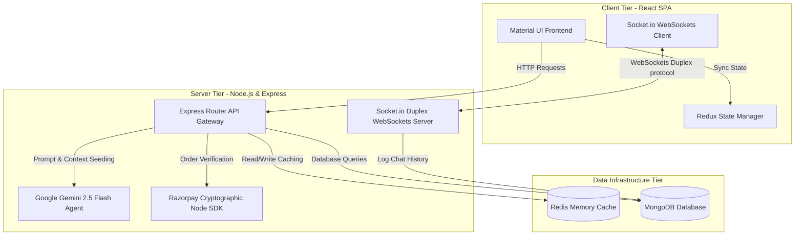
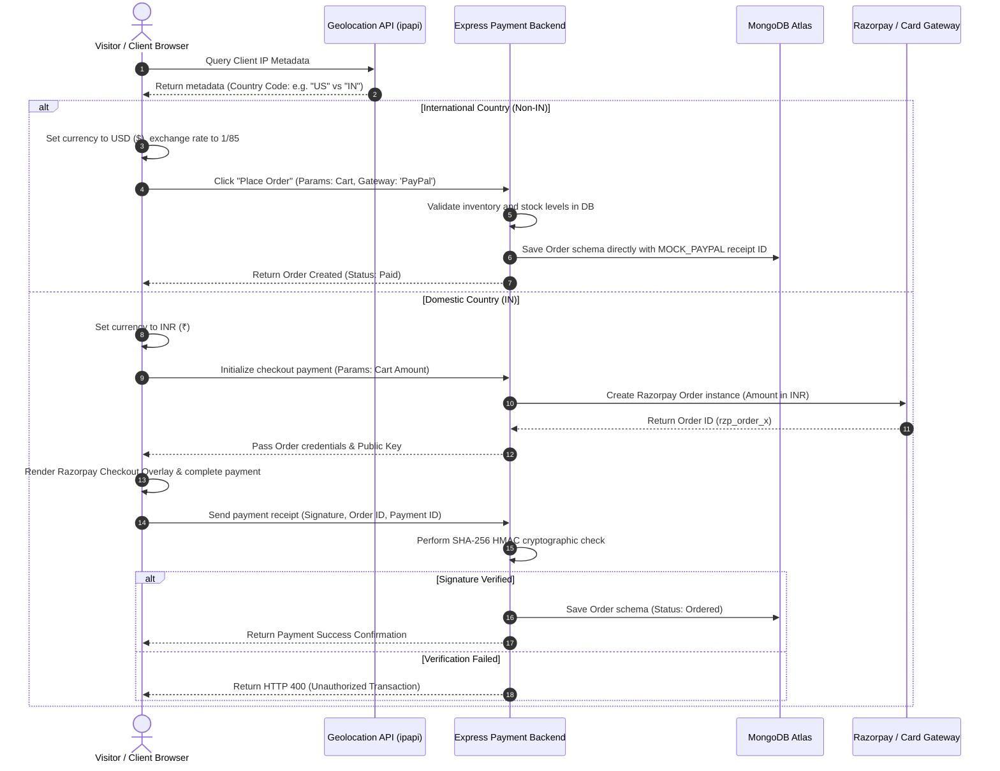

# 🛒 Flipkart Clone (MERN Stack with Gemini AI & Payments)

🔗 **Live Demo (ShopSphere - E-Commerce)**: [https://flipcart-clone-mu.vercel.app](https://flipcart-clone-mu.vercel.app)  
🔗 **Live Demo (Haven - Vacation Rental)**: [https://major-project-wht3.onrender.com](https://major-project-wht3.onrender.com)

Welcome to the **Flipkart Clone**, a premium, full-featured, and modern e-commerce web application built using the MERN (MongoDB, Express, React, Node) stack. This project replicates Flipkart's classic user interface and includes advanced integrations like **Razorpay Payments**, an **interactive Gemini AI Shopping Assistant**, and a fully-functioning **Admin Control Dashboard**.

---

## 🚀 Key Features

### 1. Frontend & UI
* **Material-UI (MUI)**: Styled with premium Material-UI design tokens to perfectly mimic Flipkart's headers, banners, sliders, and cart pages.
* **Redux State Management**: Handles shopping cart operations (add, remove, count badge updates) and product catalog fetches.
* **Fully Responsive**: Optimized for desktop, tablet, and mobile views.

### 2. Advanced Integrations
* **💳 Localized Payments & Geolocation**: Features an **IP Geolocation-based country detection system** (via `ipapi.co`). Automatically formats all catalog prices dynamically in `₹` (INR) or `$` (USD) using `Intl.NumberFormat` at a stable exchange rate. Restructures checkout flows: domestic users checkout via **Razorpay Payments API** (secured by backend SHA-256 HMAC verification), whereas international users checkout via a custom **PayPal/Credit Card dialog checkout**.
* **💬 Real-Time Admin Support Chat**: Built a duplex communication channel using **Socket.io** to connect customers with the support desk. Includes room-based message isolation, message log persistence in MongoDB, and an admin workspace dashboard using Mongoose aggregation pipelines to sort active support threads dynamically.
* **🤖 Gemini AI Chatbot Assistant**: A stateful floating shopping assistant powered by Google Gemini 2.5 Flash. Utilizes LangChain context windowing to feed store inventory and answer user product catalog queries with real-time suggestions.
* **👥 Group Buying (Team Buy) System**: Social group booking system enabling 15% team discounts, checking team completions dynamically to trigger Razorpay checkout authorizations.
* **📄 Print-ready Tax Invoices**: Generates professional PDF-ready tax invoices directly from the client-side *My Orders* dashboard.

### 3. Performance & Caching (Backend)
* **⚡ Redis Database Caching**: Integrates a high-performance Redis cache layer. Product search queries and product details fetches are cached (TTL: 1 hour), reducing read latencies to <2ms.
* **🛡️ Fail-Safe Connection Fallback**: Implements a resilient fallback handler. If Redis server is down or unconfigured, it logs a warning and automatically falls back to direct MongoDB database reads without crashing the app.
* **🔄 Automatic Cache Invalidation**: Employs cache invalidation protocols. Adding, updating, or deleting products by sellers instantly invalidates corresponding query indexes (`products:query:*`) and specific product caches (`product:id`) to prevent stale reads.
* **🔢 Optional API Pagination**: Supports optional paginated queries (`?page=1&limit=10`) with skip/limit calculations, maintaining complete backward compatibility.

### 4. Management & Security
* **🔒 Custom Authentication**: Secure JWT-based User Signup and Login dialogues with OTP verification & Google OAuth integration.
* **👤 Profile & Address Manager (`/profile`)**: Manage user profile information and save multiple shipping addresses (Home/Work) with default selections.
* **❤️ Saved Wishlist (`/wishlist`)**: Save and manage products to purchase later, with single-click additions directly from product pages.
* **🛠️ Admin Dashboard (`/admin`)**:
  - **Inventory CRUD**: Add new items, update stock count, delete products, or import seed data from external APIs.
  - **Order Shipping Workflow**: Track all customer orders and update shipping statuses (`Ordered` ➡️ `Shipped` ➡️ `Out for Delivery` ➡️ `Delivered`). Modifying the status dynamically updates the customer's delivery progress bar!

---

## 📐 Backend System Architecture & Data Pipelines

The system is engineered as a decoupled MERN architecture with high-concurrency real-time layers, memory-caching gateways, and cryptographic transaction boundaries.

### 1. High-Level Architecture Flowchart


### 2. Transactional Checkout & IP Geolocation Routing Pipeline
Below is the sequence diagram illustrating how the backend dynamically converts currency and routes payment transactions:


---

## 🧠 Deep-Dive Backend Architecture Specifications

### 1. Duplex WebSockets (Socket.io Support System)
* **Isolated Room Management**: To prevent message leaks, sockets are dynamically grouped into isolated room IDs using the schema `${userId}`. The admin enters the same room to communicate directly with the customer.
* **Persistent History**: Every duplex frame sent is logged permanently into MongoDB. 
* **Dynamic Sorting Aggregation**: The admin panel uses Mongoose aggregation queries to sort active chat threads. It counts unread frames and groups sessions by client ID dynamically, ordering the queue by the latest timestamp.

### 2. Distributed Caching (Redis Database Cache)
* **Read-Through Architecture**: Catalog queries first check the Redis memory layer. If there is a cache hit, the JSON response is returned directly in under 2ms. If there is a cache miss, the server queries MongoDB, caches the result with a 1-hour TTL, and returns the response.
* **Active Cache Invalidation**: Adding, updating, or deleting products by admin triggers cache invalidation. It deletes the specific product cache (`product:id`) and clears the catalog queries indexes (`products:query:*`) to prevent stale reads.
* **Fail-Safe Mechanism**: The Redis connection is wrapped in a fail-safe fallback middleware. If the Redis server crashes or is unavailable, the application logs a warning and automatically routes all traffic to MongoDB without interrupting the service.

### 3. Cryptographic Checkout (HMAC SHA-256 Signature Verification)
* During domestic transactions, the backend validates Razorpay signatures. It creates a cryptographic SHA-256 HMAC hash using the transaction parameters (`razorpay_order_id + "|" + razorpay_payment_id`) and the server's private key. If the hash matches the signature sent by the client, the order is finalized. This prevents client-side manipulation of transaction status or order amounts.

---

## 🛠️ Tech Stack

* **Frontend**: React (v19), React Router (v7), Redux Toolkit, Material-UI (MUI v7), Axios, Socket.io-client.
* **Backend**: Node.js, Express.js, Mongoose, Socket.io.
* **Database & Caching**: MongoDB (Local or Atlas Cloud), Redis (Cache Client).
* **AI Integration**: Google Generative AI (`gemini-2.5-flash`).
* **Payments**: Razorpay Node SDK.

---

## 📂 Project Directory Structure

```
├── client/                 # React Frontend Application
│   ├── public/             # Static files (HTML, favicon)
│   └── src/
│       ├── components/     # UI Components (header, home, cart, details, admin, orders, ai)
│       ├── context/        # React Context API providers
│       ├── redux/          # Redux Toolkit setup for cart & products
│       └── service/        # Axios API backend client services
│
└── server/                 # Express Backend Server API
    ├── database/           # MongoDB Connection configuration
    ├── controllers/        # Route controllers (auth, product, payment, orders, admin, AI)
    ├── model/              # Mongoose schemas (user, product, order)
    ├── routes/             # Express routing endpoint declarations
    └── server.js           # Server initialization entrypoint
```

---

## ⚙️ Environment Configurations

Create a `.env` file inside the `server/` directory and populate it as shown below. You can refer to [server/.env.example](file:///c:/Users/Lenovo/OneDrive/Desktop/FLipcart/server/.env.example):

```env
MONGO_URI=mongodb://localhost:27017/flipcart
RAZORPAY_KEY_ID=rzp_test_your_key_id_here
RAZORPAY_KEY_SECRET=your_key_secret_here
JWT_SECRET=your_jwt_secret_key_here
GEMINI_API_KEY=your_gemini_api_key_here
REDIS_URL=redis://localhost:6379
```

> [!NOTE]
> To get a free Google Gemini API Key, head over to [Google AI Studio](https://aistudio.google.com/). If no key is set, the chatbot will run in **offline demonstration mode**.

---

## 🚀 Running the Project Locally

### Step 1: Clone and install backend dependencies
```bash
# Go to server directory
cd server
# Install Node modules
npm install
```

### Step 2: Seed the Product Catalog
Make sure MongoDB is running locally. Then run the seed script to populate products:
```bash
# Start backend server (starts on port 8000)
npm run dev
```
Open a browser and navigate to `http://localhost:8000/api/products/import`. This imports 30 premium products from DummyJSON into your local database.

### Step 3: Set up frontend
Open a new terminal tab:
```bash
# Go to client directory
cd client
# Install frontend dependencies
npm install
# Launch React Dev Server (runs on port 3000)
npm start
```

Open `http://localhost:3000` to view the clone.

---

## 💡 Key API Endpoints

### 🔐 User & Auth
* `POST /api/signup` - Register a new user account.
* `POST /api/login` - Authenticate user credentials and issue a session.
* `POST /api/send-otp` - Send 6-digit OTP verification email.
* `POST /api/verify-otp` - Verify OTP to validate email address.
* `POST /api/google-login` - Authenticate users via Google Sign-In.

### 📦 Catalog & Reviews
* `GET /api/products` - Retrieve all products with optional filters.
* `GET /api/products/import` - Seed 30 DummyJSON products to database.
* `GET /api/products/reset` - Restore all default Flipkart seed products to database.
* `GET /api/products/:id` - Fetch details for a specific product.
* `GET /api/products/:id/similar` - Get 5 similar products from the same category.
* `POST /api/products/:id/review` - Add a customer review & rating.
* `GET /api/products/:id/reviews` - Fetch reviews written for a product.
* `POST /api/translate` - Translate comments/reviews using Gemini AI.

### 🛒 Cart & Checkout
* `POST /api/order/create` - Place a new order in the database.
* `GET /api/orders/:username` - Retrieve all orders placed by a specific user.
* `POST /api/payment/create` - Generate a Razorpay order ID.
* `POST /api/payment/verify` - Verify Razorpay signature and authorize transaction.

### 👥 Group Buying (Team Buy)
* `POST /api/group-buy/create` - Create/start a new group buy session.
* `POST /api/group-buy/join` - Join an active group buy checkout.
* `GET /api/group-buy/active/:productId` - Get all active group buys for a product.
* `GET /api/group-buy/:id` - Retrieve specific group buy details & team progress.

### ❤️ Wishlist
* `POST /api/wishlist/toggle` - Save or remove a product in the user's wishlist.
* `GET /api/wishlist/:userId` - Get all products in a user's wishlist.

### 📍 Shipping Address Manager
* `POST /api/address/add` - Save a new shipping address.
* `GET /api/address/:userId` - Fetch all saved addresses for a user.
* `PUT /api/address/:id` - Edit a saved address.
* `DELETE /api/address/:id` - Remove an address.

### 🎟️ Coupons & Alerts
* `POST /api/coupon/validate` - Validate coupon codes for order discount.
* `POST /api/coupon/create` - Add a new coupon code (Admin only).
* `POST /api/alerts/subscribe` - Subscribe to price drop email alerts for a product.
* `GET /api/notifications/:username` - Get all notifications for a user.
* `POST /api/notifications/read` - Mark all user notifications as read.

### 🤖 Gemini AI Shopping Assistant
* `POST /api/chat` - Interact with the AI assistant feed with product catalog schema.

### 🛠️ Admin Dashboard
* `GET /api/admin/orders` - Retrieve all orders across the system.
* `PUT /api/admin/orders/:id` - Update the shipping status of an order.
* `POST /api/admin/products` - Add a new product to database catalog.
* `PUT /api/admin/products/:id` - Edit an existing product details or stock status.
* `DELETE /api/admin/products/:id` - Delete a product from inventory.