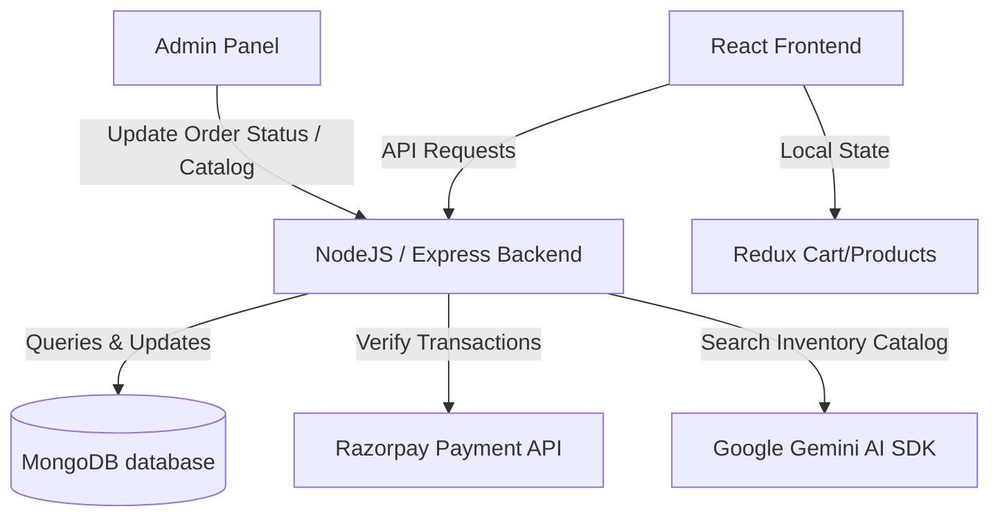

# 🛒 Flipkart Clone (MERN Stack with Gemini AI & Payments)

Welcome to the **Flipkart Clone**, a premium, full-featured, and modern e-commerce web application built using the MERN (MongoDB, Express, React, Node) stack. This project replicates Flipkart's classic user interface and includes advanced integrations like **Razorpay Payments**, an **interactive Gemini AI Shopping Assistant**, and a fully-functioning **Admin Control Dashboard**.

---

## 🚀 Key Features

### 1. Frontend & UI
* **Material-UI (MUI)**: Styled with premium Material-UI design tokens to perfectly mimic Flipkart's headers, banners, sliders, and cart pages.
* **Redux State Management**: Handles shopping cart operations (add, remove, count badge updates) and product catalog fetches.
* **Fully Responsive**: Optimized for desktop, tablet, and mobile views.

### 2. Advanced Integrations
* **💳 Razorpay Payment Gateway**: Features a backend-authenticated Razorpay API flow verifying checkout payments securely.
* **🤖 Gemini AI Chatbot Assistant**: A floating interactive shopping assistant powered by Google Gemini (using the `@google/generative-ai` SDK). It feeds on the store's current MongoDB inventory to provide real-time suggestions and alternatives for out-of-stock items. Fallback offline mockup mode is active if no API key is configured.
* **👥 Group Buying (Team Buy) System**: Buy products at a 15% discount by starting or joining group buy teams! Integrates with Razorpay payments and checks order completeness status dynamically.
* **📄 Print-ready Tax Invoices**: Generates a professional tax invoice directly from the client-side *My Orders* page using native print layouts, easily exportable as PDF.

### 3. Management & Security
* **🔒 Custom Authentication**: Secure JWT-based User Signup and Login dialogues with OTP verification & Google OAuth integration.
* **👤 Profile & Address Manager (`/profile`)**: Manage user profile information and save multiple shipping addresses (Home/Work) with default selections.
* **❤️ Saved Wishlist (`/wishlist`)**: Save and manage products to purchase later, with single-click additions directly from product pages.
* **🛠️ Admin Dashboard (`/admin`)**:
  - **Inventory CRUD**: Add new items, update stock count, delete products, or import seed data from external APIs (DummyJSON API integration).
  - **Order Shipping Workflow**: Track all customer orders and update shipping statuses (`Ordered` ➡️ `Shipped` ➡️ `Out for Delivery` ➡️ `Delivered`). Modifying the status dynamically updates the customer's delivery progress bar!

---

## 📐 System Architecture

Below is the high-level architecture diagram detailing the client-server interaction:



---

## 🛠️ Tech Stack

* **Frontend**: React (v19), React Router (v7), Redux Toolkit, Material-UI (MUI v7), Axios.
* **Backend**: Node.js, Express.js, Mongoose.
* **Database**: MongoDB (Local or Atlas Cloud).
* **AI Integration**: Google Generative AI (`gemini-1.5-flash`).
* **Payments**: Razorpay Node SDK.

---

## 📂 Project Directory Structure

```
├── client/                 # React Frontend Application
│   ├── public/             # Static files (HTML, favicon)
│   └── src/
│       ├── components/     # UI Components (header, home, cart, details, admin, orders, ai)
│       ├── context/        # React Context API providers
│       ├── redux/          # Redux Toolkit setup for cart & products
│       └── service/        # Axios API backend client services
│
└── server/                 # Express Backend Server API
    ├── database/           # MongoDB Connection configuration
    ├── controllers/        # Route controllers (auth, product, payment, orders, admin, AI)
    ├── model/              # Mongoose schemas (user, product, order)
    ├── routes/             # Express routing endpoint declarations
    └── server.js           # Server initialization entrypoint
```

---

## ⚙️ Environment Configurations

Create a `.env` file inside the `server/` directory and populate it as shown below. You can refer to [server/.env.example](file:///c:/Users/Lenovo/OneDrive/Desktop/FLipcart/server/.env.example):

```env
MONGO_URI=mongodb://localhost:27017/flipcart
RAZORPAY_KEY_ID=rzp_test_your_key_id_here
RAZORPAY_KEY_SECRET=your_key_secret_here
JWT_SECRET=your_jwt_secret_key_here
GEMINI_API_KEY=your_gemini_api_key_here
```

> [!NOTE]
> To get a free Google Gemini API Key, head over to [Google AI Studio](https://aistudio.google.com/). If no key is set, the chatbot will run in **offline demonstration mode**.

---

## 🚀 Running the Project Locally

### Step 1: Clone and install backend dependencies
```bash
# Go to server directory
cd server
# Install Node modules
npm install
```

### Step 2: Seed the Product Catalog
Make sure MongoDB is running locally. Then run the seed script to populate products:
```bash
# Start backend server (starts on port 8000)
npm run dev
```
Open a browser and navigate to `http://localhost:8000/api/products/import`. This imports 30 premium products from DummyJSON into your local database.

### Step 3: Set up frontend
Open a new terminal tab:
```bash
# Go to client directory
cd client
# Install frontend dependencies
npm install
# Launch React Dev Server (runs on port 3000)
npm start
```

Open `http://localhost:3000` to view the clone.

---

## 💡 Key API Endpoints

### User & Auth
* `POST /api/signup` - Register a new user account.
* `POST /api/login` - Authenticate user credentials and issue a session.

### Catalog
* `GET /api/products` - Retrieve all products in the database.
* `GET /api/products/:id` - Fetch details for a specific product.

### Customer Operations
* `POST /api/order/create` - Place a new order log in the system.
* `GET /api/orders/:username` - Get orders tracking log for a particular user.
* `POST /api/chat` - Send a message context to the Gemini AI chatbot.

### Payments
* `POST /api/payment/create` - Initialize a Razorpay Order ID.
* `POST /api/payment/verify` - Validate transaction signature.

### Admin Dashboard (New)
* `GET /api/admin/orders` - Get all orders across the entire app.
* `PUT /api/admin/orders/:id` - Change shipping status.
* `POST /api/admin/products` - Add a new product to inventory.
* `PUT /api/admin/products/:id` - Update stock level or detail.
* `DELETE /api/admin/products/:id` - Remove a product from the database.